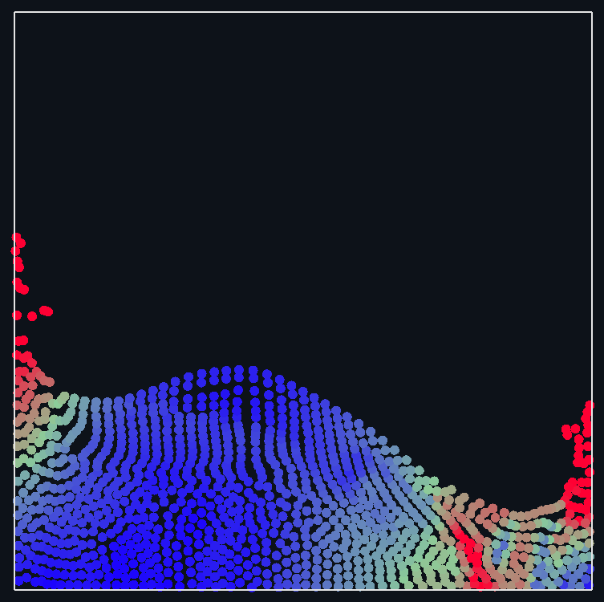

# Real-time Smoothed Particle Hydrodynamics Solver

<p align="center">
  
</p>

A small C++20 Smoothed Particle Hydrodynamics (SPH) fluid simulation rendered with OpenGL. The project simulates a block of fluid particles in a 2D unit domain using density estimation, Tait equation-of-state pressure, viscosity, gravity, ghost-particle wall handling, and a spatial hash grid for neighbor lookup.

## Features

- Real-time 2D SPH particle simulation
- OpenGL 3.3 particle rendering
- Spatial hash grid neighbor search
- Fixed-timestep simulation loop with substep budgeting
- Ghost particles for boundary interaction near domain walls
- Runtime controls for pause, reset, and exit

## Requirements

- CMake 3.20 or newer
- A C++20 compiler
- Python launcher available as `py`
- OpenGL-capable graphics driver
- Git, so CMake can fetch dependencies

Dependencies are fetched by CMake:

- GLFW 3.3.9
- GLAD 2.0.6

## Build

From the repository root:

```powershell
cmake -S . -B out/build
cmake --build out/build
```

If you are using Visual Studio's CMake integration, you can also open the folder directly and build the `sph` target from the IDE.

## Run

After building, run the generated `sph` executable from the build output directory. The exact path depends on your CMake generator and configuration.


## Controls

- `P`: pause or resume the simulation
- `R`: respawn the fluid block
- `Left mouse`: repel nearby particles
- `Right mouse`: pull a clump of nearby particles toward the cursor
- `Esc`: close the window

## Project Layout

```text
src/
  main.cpp                  Application entry point, window loop, controls
  sph/
    solver.cpp              SPH simulation update, density, pressure, forces
    particle.cpp            Particle data types
    render.cpp              OpenGL renderer
    spatial_hash_grid.cpp   Neighbor search acceleration structure
    kernels.hpp             SPH smoothing kernels
    time_manager.hpp        Fixed timestep helper
    math/vec2.hpp           2D vector math
```


## Mathematical Model
Properties such as density, pressure, and viscosity at a point in the fluid are evaluated by summing the influences from nearby particles using a smoothing function. In SPH the properties are approximated by:

$$
A(\mathbf{r}) = \sum_j \frac{m_j}{\rho_j} A(\mathbf{r}_j) W(\mathbf{r} - \mathbf{r}_j, h)
$$


The property `A(r)` for a particle, `i`, is calculated by summing the neighbouring particles, `j`, `A` property and multiplying it by their influence defined by the kernel function, `W`. (Liu, 2010).

### Density

Particle density is estimated with the poly6 smoothing kernel:

$$
\rho_i = \sum_j m_j W_{\text{poly6}}(\lVert \mathbf{r}_i - \mathbf{r}_j \rVert)
$$

where:

$$
W_{\text{poly6}}(r) =
\begin{cases}
\dfrac{4}{\pi h^8}(h^2 - r^2)^3, & 0 \le r < h \\
0, & r \ge h
\end{cases}
$$

### Pressure
Once the solver has iterated over all the particles to calculate their density, the density of the particles is used to compute the pressure using the Tait equation of state:

$$
p_i = k \left[\left(\frac{\rho_i}{\rho_0}\right)^\gamma - 1\right]
$$

$$
k = \frac{\rho_0 c_0^2}{\gamma}
$$


### Pressure Force
The pressure force term is defined in the Navier-Stokes conservation of momentum equation and acceleration due to pressure can be found:

$$
\mathbf{a}_{\text{pressure}} =
-\frac{1}{\rho} \nabla p
$$

The derivative of the kernel function, $\nabla W$, is used to approximate the pressure field, $\nabla p$, similarly to the density and pressure approximations. To approximate the gradient of a scalar field, $A$, at position $\mathbf{r}$:

$$
\nabla A(\mathbf{r}) =
\sum_i \frac{m_i}{\rho_i} A(\mathbf{r}_i)
\nabla W(\mathbf{r} - \mathbf{r}_i, h)
$$

For the pressure field:

$$
\nabla p_i =
\sum_j m_j \frac{p_j}{\rho_j}
\nabla W(\mathbf{r}_i - \mathbf{r}_j, h)
$$

To ensure conservation of momentum, the pressure gradient is symmetrized. Instead of only considering $p_j$, the contributions from both particles need to be considered.

Symmetrised pressure field approximation:

$$
\nabla p_i =
\sum_j m_j
\left(
\frac{p_i}{\rho_i^2} + \frac{p_j}{\rho_j^2}
\right)
\nabla W(\mathbf{r}_i - \mathbf{r}_j, h)
$$

The term
$\frac{p_i}{\rho_i^2} + \frac{p_j}{\rho_j^2}$
ensures conservation by exerting equal and opposite forces on particles $i$ and $j$. The final approximation becomes:

$$
\mathbf{a}_{i,\text{pressure}} =
-\sum_j m_j
\left(
\frac{p_i}{\rho_i^2} + \frac{p_j}{\rho_j^2}
\right)
\nabla W_{\text{spiky}}(\mathbf{r}_i - \mathbf{r}_j)
$$

The spiky kernel gradient is:

$$
\nabla W_{\text{spiky}}(\mathbf{r}_{ij}) =
-\frac{30}{\pi h^5}
\frac{(h-r)^2}{r}
\mathbf{r}_{ij},
\qquad 0 < r < h
$$

### Viscosity

The viscosity force comes from the viscous term in the Navier-Stokes conservation of momentum equation. Written as acceleration, the term is:

$$
\mathbf{a}_{\text{viscosity}} =
\nu \nabla^2 \mathbf{v}
$$

where the kinematic viscosity is:

$$
\nu = \frac{\mu}{\rho}
$$

To approximate the Laplacian of a vector field, the second derivative of the kernel function can be used, but using the second derivative of the kernel often produces inaccurate and noisy results. Instead, Brookshaw proposed a first derivative-based formulation for approximating the Laplacian of a scalar field $A(\mathbf{r})$:

$$
\nabla^2 A_i(\mathbf{r}) =
2 \sum_j \frac{m_j}{\rho_j}
\frac{A_j - A_i}
{\left\lVert \mathbf{r}_{ij} \right\rVert^2 + \eta^2}
\left(
\mathbf{r}_{ij} \cdot
\nabla W(\mathbf{r} - \mathbf{r}_j, h)
\right)
$$

Applying this same first derivative-based approximation to velocity gives:

$$
\nabla^2 \mathbf{v}_i =
2 \sum_j \frac{m_j}{\rho_j}
\frac{\mathbf{v}_j - \mathbf{v}_i}
{\lVert \mathbf{r}_{ij} \rVert^2 + \eta^2}
\left(
\mathbf{r}_{ij} \cdot
\nabla W(\mathbf{r}_{ij}, h)
\right)
$$

where:

$$
\mathbf{r}_{ij} = \mathbf{r}_i - \mathbf{r}_j
$$

$$
\eta^2 = 0.01h^2
$$

Substituting the Laplacian approximation into the viscosity acceleration gives:

$$
\mathbf{a}_{i,\text{viscosity}} =
2\nu \sum_j \frac{m_j}{\rho_j}
\frac{\mathbf{v}_j - \mathbf{v}_i}
{\lVert \mathbf{r}_{ij} \rVert^2 + \eta^2}
\left(
\mathbf{r}_{ij} \cdot
\nabla W(\mathbf{r}_{ij}, h)
\right)
$$

## Neighbor Search Algorithm

SPH only needs interactions between particles within the smoothing length, `h`. This project uses a spatial hash grid to reduce the number of distance checks.

The simulation domain is divided into square grid cells with side length equal to the smoothing length:

$$
\text{cell size} = h
$$

Each particle position is converted into integer grid coordinates:

$$
i_x = \left\lfloor \frac{x}{h} \right\rfloor
$$

$$
i_y = \left\lfloor \frac{y}{h} \right\rfloor
$$

The integer cell coordinate is then converted into a hash key:

$$
\text{hash}(i_x, i_y) =
(i_x \cdot 83492791) \oplus (i_y \cdot 2654435761)
$$

where $\oplus$ is the bitwise XOR operation. The grid stores a map from each hash key to the list of particle indices inside that cell.

At the beginning of each update, the solver clears and rebuilds the grid. Every particle is inserted into the cell containing its current position. When finding neighbors for particle `i`, the solver checks the particle's own cell and the eight surrounding cells:

$$
(i_x + a, i_y + b),
\qquad
a,b \in \{-1, 0, 1\}
$$

This gives a maximum of nine grid cells to search. Particles found in those cells are then filtered by distance, so only particles with:

$$
\lVert \mathbf{r}_i - \mathbf{r}_j \rVert < h
$$

contribute to the SPH density, pressure, and viscosity calculations.

### Time Integration

Particles are advanced with a half-step velocity update:

$$
\mathbf{v}_{\text{half}} =
\mathbf{v}_{\text{half}} + \mathbf{a}_i \Delta t
$$

$$
\mathbf{x}_i =
\mathbf{x}_i + \mathbf{v}_{\text{half}} \Delta t
$$

$$
\mathbf{v}_i =
\mathbf{v}_{\text{half}} + \frac{1}{2}\mathbf{a}_i \Delta t
$$
